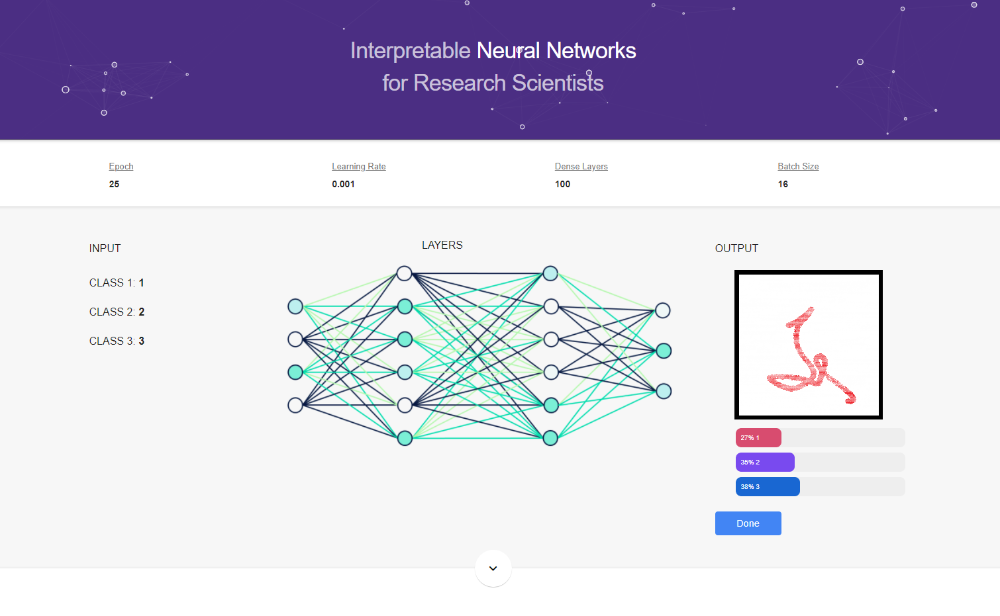

<!-- PROJECT SHIELDS -->
<!--
*** I'm using markdown "reference style" links for readability.
*** Reference links are enclosed in brackets [ ] instead of parentheses ( ).
*** See the bottom of this document for the declaration of the reference variables
*** for contributors-url, forks-url, etc. This is an optional, concise syntax you may use.
*** https://www.markdownguide.org/basic-syntax/#reference-style-links
-->
[![Forks][forks-shield]][forks-url]
[![Issues][issues-shield]][issues-url]
[![LinkedIn][linkedin-shield]][linkedin-url]

<!-- PROJECT ICON -->
 

  

  <h3 align="center">NN for researchers</h3>
  

    This script is for a discord bot that uses the instructor canvas api to retrieve assignments, quizzes, and discussion topics in version 1.0
     
    <a href="https://github.com/khuongma/NN-for-researchers"><strong>Explore the docs »</strong></a>
     
     
    <a href="https://github.com/khuongma/NN-for-researchers/issues">Report Bug</a>
    ·
    <a href="https://github.com/khuongma/NN-for-researchers/issues">Request Feature</a>
  

<!-- TABLE OF CONTENTS -->
## Table of Contents

* [About the Project](#about-the-project)
  * [Built With](#built-with)
* [Getting Started](#getting-started)
  * [Prerequisites](#prerequisites)
* [Usage](#usage)
* [Contributing](#contributing)
* [Contact](#contact)

<!-- ABOUT THE PROJECT -->
## About The Project

[[NN for Researchers Screen Shot]](https://example.com)

### Built With

* [JavaScript](https://www.javascript.com/)
* [TensorFlow](https://www.tensorflow.org/)
* [Visual Studio Code](https://code.visualstudio.com/)

<!-- GETTING STARTED -->
## Getting Started

Download the entire github repo and make sure you have the following things installed below.

### Prerequisites

-

<!-- USAGE EXAMPLES -->
## Usage

1. Download the repo
2. Run Visual Studio Code
3. Using Live Server extension, run index.html

Detailed documentation coming.

<!-- CONTRIBUTING -->
## Contributing

Contributions are what make the open source community such an amazing place to be learn, inspire, and create. Any contributions you make are **greatly appreciated**.

1. Fork the Project
2. Create your Feature Branch (`git checkout -b feature/AmazingFeature`)
3. Commit your Changes (`git commit -m 'Add some AmazingFeature'`)
4. Push to the Branch (`git push origin feature/AmazingFeature`)
5. Open a Pull Request

<!-- CONTACT -->
## Contact

Kun Ma - khuongma@outlook.com

Project Link: [https://github.com/khuongma/NN-for-researchers](https://github.com/khuongma/NN-for-researchers)

<!-- MARKDOWN LINKS & IMAGES -->
<!-- https://www.markdownguide.org/basic-syntax/#reference-style-links -->
[contributors-shield]: https://img.shields.io/github/contributors/khuongma/repo.svg?style=flat-square
[contributors-url]: https://github.com/khuongma/NN-for-researchers/graphs/contributors
[forks-shield]: https://img.shields.io/github/forks/khuongma/NN-for-researchers.svg?style=flat-square
[forks-url]: https://github.com/khuongma/NN-for-researchers/network/members
[stars-shield]: https://img.shields.io/github/stars/khuongma/NN-for-researchers.svg?style=flat-square
[stars-url]: https://github.com/khuongma/NN-for-researchers/stargazers
[issues-shield]: https://img.shields.io/github/issues/khuongma/NN-for-researchers.svg?style=flat-square
[issues-url]: https://github.com/khuongma/NN-for-researchers/issues
[license-shield]: https://img.shields.io/github/license/khuongma/NN-for-researchers.svg?style=flat-square
[license-url]: https://github.com/khuongma/NN-for-researchers/blob/main/LICENSE
[linkedin-shield]: https://img.shields.io/badge/-LinkedIn-black.svg?style=flat-square&logo=linkedin&colorB=555
[linkedin-url]: https://linkedin.com/in/khuongma
[product-screenshot]: assets/screenshot.png
